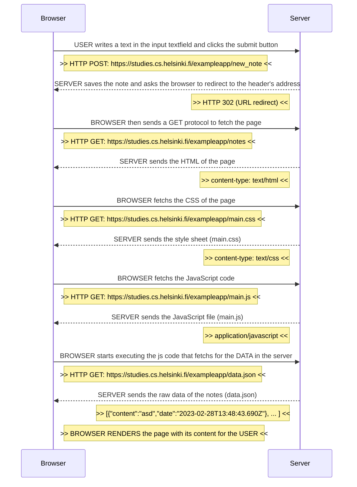

```mermaid

sequenceDiagram
    Browser->>Server: USER writes a text in the input textfield and clicks the submit button
    Note right of Browser: >> HTTP POST: https://studies.cs.helsinki.fi/exampleapp/new_note <<
    Server-->>Browser: SERVER saves the note and asks the browser to redirect to the header's address
    Note left of Server: >> HTTP 302 (URL redirect) <<
    Browser->>Server: BROWSER then sends a GET protocol to fetch the page
    Note right of Browser: >> HTTP GET: https://studies.cs.helsinki.fi/exampleapp/notes <<
    Server-->>Browser: SERVER sends the HTML of the page
    Note left of Server: >> content-type: text/html <<
    Browser->>Server: BROWSER fetchs the CSS of the page
    Note right of Browser: >> HTTP GET: https://studies.cs.helsinki.fi/exampleapp/main.css <<
    Server-->>Browser: SERVER sends the style sheet (main.css)
    Note left of Server: >> content-type: text/css <<
    Browser->>Server: BROWSER fetchs the JavaScript code
    Note right of Browser: >> HTTP GET: https://studies.cs.helsinki.fi/exampleapp/main.js <<
    Server-->>Browser: SERVER sends the JavaScript file (main.js)
    Note left of Server: >> application/javascript <<
    Browser->>Server: BROWSER starts executing the js code that fetchs for the DATA in the server
    Note right of Browser: >> HTTP GET: https://studies.cs.helsinki.fi/exampleapp/data.json <<
    Server-->>Browser: SERVER sends the raw data of the notes (data.json)
    Note left of Server: >> [{"content":"asd","date":"2023-02-28T13:48:43.690Z"}, ... ] <<
    Note right of Browser: >> BROWSER RENDERS the page with its content for the USER <<


```
