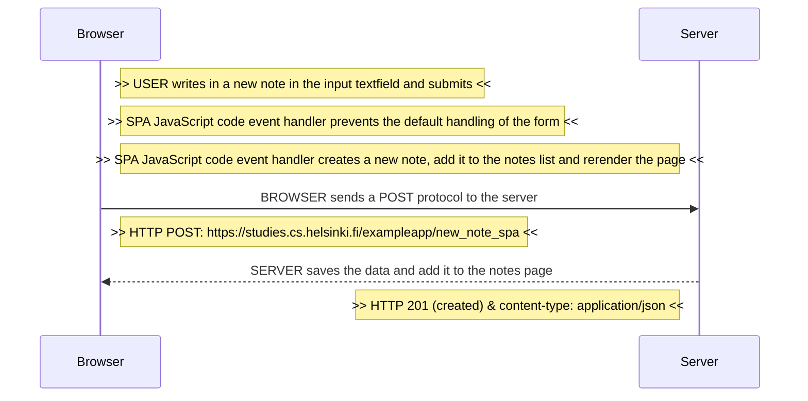

```mermaid

sequenceDiagram
    Note right of Browser: >> USER writes in a new note in the input textfield and submits <<
    Note right of Browser: >> SPA JavaScript code event handler prevents the default handling of the form <<
    Note right of Browser: >> SPA JavaScript code event handler creates a new note, add it to the notes list and rerender the page <<
    Browser->>Server: BROWSER sends a POST protocol to the server
    Note right of Browser: >> HTTP POST: https://studies.cs.helsinki.fi/exampleapp/new_note_spa <<
    Server-->>Browser: SERVER saves the data and add it to the notes page
    Note left of Server: >> HTTP 201 (created) & content-type: application/json <<

```
